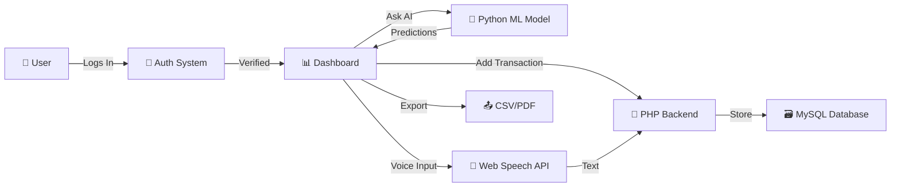

<div align="center">

<!-- ✨ Animated Top Banner ✨ -->


<!-- 🌸 Sparkle Divider 🌸 -->


<br/>

<!-- 🎀 Animated Badges 🎀 -->


<br/><br/>

<!-- 💖 Typing SVG 💖 -->
<a href="https://github.com/alishba-irfan1/cash-flow">

</a>

<br/><br/>

<!-- 🌷 Cute Repo Link 🌷 -->
<a href="https://github.com/alishba-irfan1/cash-flow">

</a>

</div>

---

<!-- 🌸 Floating Sakura 🌸 -->


## 🌸 About CashFlow

**CashFlow** is not just another finance tracker — it's your *aesthetic*, *AI-powered* financial bestie! 💖 Built with love and sprinkled with pink vibes, this web app helps you track expenses, predict future spending with machine learning, and manage your money like a queen. 👑✨

> 🎀 *Because your finances deserve to be as pretty as you are!* 🌸

### ✨ What Makes It Special

| 💖 Feature | 🌸 Description |
|:---|:---|
| 🧠 **AI Predictions** | Machine learning model predicts your future spending patterns |
| 🎤 **Voice Input** | Speak your transactions instead of typing — hands-free queen! |
| 🌙 **Dark Mode** | Gorgeous pink-tinted dark mode for late-night budgeting |
| 📊 **Smart Dashboard** | Visualize your cash flow with beautiful charts |
| 📤 **Export Data** | Export your transactions anytime, anywhere |
| 🔐 **Secure Auth** | Safe & secure login system to protect your data |

---

<!-- 🎀 Cute Divider 🎀 -->
<div align="center">

</div>

---

## 🗂️ Project Structure

```
🌸 CASH FLOW/
│
├── 🏠 index.html ................... Landing page
├── 📊 dashboard.html ............... Main dashboard
│
├── 🎨 css/
│   ├── style.css ................... Main stylesheet (pink aesthetics ✨)
│   └── dark-mode.css .............. Dark mode magic 🌙
│
├── ⚡ js/
│   ├── auth.js ..................... Authentication logic 🔐
│   ├── dashboard.js ................ Dashboard interactions 📊
│   ├── voice-input.js .............. Voice recognition 🎤
│   ├── export.js ................... Data export feature 📤
│   └── dark-mode.js ................ Theme toggle 🌙
│
├── 🐘 php-backend/
│   ├── config.php .................. Database configuration ⚙️
│   ├── auth.php .................... Auth endpoints 🔐
│   ├── transactions.php ............ Transaction CRUD 💸
│   └── ai-predictions.php .......... AI integration bridge 🤖
│
├── 🐍 python-ml/
│   ├── requirements.txt ............ Python dependencies 📦
│   ├── prediction_model.py ......... ML prediction model 🧠
│   └── run_model.py ................ Model runner 🚀
│
└── 🗃️ database/
    └── setup.sql ................... Database schema setup 💾
```

---

<!-- 🌷 Step-by-step section 🌷 -->
<div align="center">

</div>

### 📋 Prerequisites

Before we begin, make sure you have these installed like a good girl! 💁‍♀️✨

| 🎀 Requirement | 🔗 Link | 💖 Purpose |
|:---|:---|:---|
| **XAMPP** / **WAMP** | [Download XAMPP](https://www.apachefriends.org/) | PHP & MySQL server 🐘 |
| **Python 3.8+** | [Download Python](https://www.python.org/) | ML predictions 🐍 |
| **A Browser** | Any modern browser | To view the magic 🌸 |
| **Git** | [Download Git](https://git-scm.com/) | Clone this repo 💕 |

---

### 🚀 Step-by-Step Installation

<!-- Step 1 -->
<table>
<tr>
<td width="80" align="center">

</td>
<td>

### 🍫 Clone the Repository

Open your terminal and type:

```bash
git clone https://github.com/alishba-irfan1/cash-flow.git
```

Move the project to your XAMPP `htdocs` folder:

```bash
# For XAMPP
mv cash-flow C:/xampp/htdocs/

# For WAMP
mv cash-flow C:/wamp64/www/
```

> 🌸 *Tip: Make sure XAMPP/WAMP is installed first, bestie!*

</td>
</tr>
</table>

<!-- Step 2 -->
<table>
<tr>
<td width="80" align="center">

</td>
<td>

### 🐘 Start XAMPP / WAMP

1. Open **XAMPP Control Panel** (or WAMP)
2. Click **Start** on both **Apache** 🌐 and **MySQL** 🗄️
3. Wait until both show **green** — you're glowing! ✨

```
Apache  →  [Start]  ✅ Running
MySQL   →  [Start]  ✅ Running
```

</td>
</tr>
</table>

<!-- Step 3 -->
<table>
<tr>
<td width="80" align="center">

</td>
<td>

### 🗃️ Setup the Database

1. Open your browser and go to: `http://localhost/phpmyadmin`
2. Click **"New"** in the left sidebar to create a new database
3. Name it: `cashflow_db` 💖
4. Click the **"Import"** tab at the top
5. Choose the file: `database/setup.sql` from the project
6. Click **"Go"** and watch the magic happen! ✨

> 🎀 *Your database is now sparkling clean and ready!*

</td>
</tr>
</table>

<!-- Step 4 -->
<table>
<tr>
<td width="80" align="center">

</td>
<td>

### ⚙️ Configure PHP Backend

Open `php-backend/config.php` and update your database credentials:

```php
<?php
$host = "localhost";
$user = "root";           // default XAMPP user
$password = "";            // default XAMPP has no password
$database = "cashflow_db";

$conn = new mysqli($host, $user, $password, $database);

if ($conn->connect_error) {
    die("Connection failed: " . $conn->connect_error);
}
?>
```

> 🌸 *Leave password empty if you're using default XAMPP settings, babe!*

</td>
</tr>
</table>

<!-- Step 5 -->
<table>
<tr>
<td width="80" align="center">

</td>
<td>

### 🐍 Setup Python ML Environment

Navigate to the `python-ml/` folder and install dependencies:

```bash
cd python-ml
pip install -r requirements.txt
```

Run the prediction model:

```bash
python run_model.py
```

> 🧠 *This powers the AI that predicts your spending — so cool, right?!*

</td>
</tr>
</table>

<!-- Step 6 -->
<table>
<tr>
<td width="80" align="center">

</td>
<td>

### 🌸 Launch the App!

Open your browser and navigate to:

```
http://localhost/cash-flow/index.html
```

🎉 **You're all set, queen!** Start tracking your cash flow with style! 💖✨

</td>
</tr>
</table>

---

<!-- 🌸 Tech Stack Section 🌸 -->
<div align="center">

</div>

<table align="center">
<tr>
<th>🎀 Layer</th>
<th>🛠️ Technology</th>
<th>💖 Icon</th>
</tr>
<tr>
<td><b>Frontend</b></td>
<td>HTML5, CSS3, JavaScript</td>
<td></td>
</tr>
<tr>
<td><b>Backend</b></td>
<td>PHP</td>
<td></td>
</tr>
<tr>
<td><b>Database</b></td>
<td>MySQL (via XAMPP/WAMP)</td>
<td></td>
</tr>
<tr>
<td><b>AI / ML</b></td>
<td>Python, scikit-learn</td>
<td></td>
</tr>
<tr>
<td><b>Voice Input</b></td>
<td>Web Speech API</td>
<td>🎤</td>
</tr>
<tr>
<td><b>Server</b></td>
<td>Apache (XAMPP / WAMP)</td>
<td></td>
</tr>
</table>

---

<!-- 🎀 Features Deep Dive 🎀 -->
<div align="center">

</div>

### 🧠 AI-Powered Predictions
<div align="center">

</div>

Our Python ML model analyzes your past transactions and predicts future spending trends. The `prediction_model.py` uses machine learning algorithms to forecast your cash flow, so you're *always* one step ahead of your budget! 💸✨

### 🎤 Voice Input
<div align="center">

</div>

Too lazy to type? Same, bestie. 🤭 Just press the mic button and say *"Spent 50 dollars on coffee"* and CashFlow does the rest! Powered by the Web Speech API for real-time voice recognition. Hands-free budgeting = queen behavior! 👑

### 🌙 Pink Dark Mode
Because regular dark mode is boring — ours has **pink-tinted** aesthetics! 🌸 Switch between light and dark mode with a single click, and watch your dashboard transform into a dreamy midnight garden. ✨🌙

### 📤 Export Transactions
Download your transaction history with one click. Perfect for when you need to share records, do taxes, or just flex your budgeting skills. 💅📊

---

<!-- 🌸 How It Works 🌸 -->
<div align="center">

</div>



---

<!-- 🌷 Folder Details 🌷 -->
<div align="center">

</div>

### 🎨 `css/` — The Aesthetic Layer
| File | 🌸 Purpose |
|:---|:---|
| `style.css` | Main stylesheet — pink gradients, smooth animations, glassmorphism cards, responsive layout |
| `dark-mode.css` | Dark mode overrides — pink-tinted dark theme that's easy on the eyes 🌙 |

### ⚡ `js/` — The Brain
| File | 🌸 Purpose |
|:---|:---|
| `auth.js` | Handles login/register forms, validation, session management |
| `dashboard.js` | Dashboard interactivity — charts, transaction lists, filters |
| `voice-input.js` | Web Speech API integration for hands-free transaction entry |
| `export.js` | Export transactions to CSV/PDF format |
| `dark-mode.js` | Theme toggle logic with localStorage persistence |

### 🐘 `php-backend/` — The Server
| File | 🌸 Purpose |
|:---|:---|
| `config.php` | Database connection configuration |
| `auth.php` | User authentication endpoints (login, register, sessions) |
| `transactions.php` | CRUD operations for transactions |
| `ai-predictions.php` | Bridge between PHP and Python ML model |

### 🐍 `python-ml/` — The AI Brain 🧠
| File | 🌸 Purpose |
|:---|:---|
| `requirements.txt` | Python package dependencies (scikit-learn, pandas, etc.) |
| `prediction_model.py` | ML model training and prediction logic |
| `run_model.py` | Script to run predictions and serve results |

### 🗃️ `database/` — The Vault
| File | 🌸 Purpose |
|:---|:---|
| `setup.sql` | Complete database schema — tables for users, transactions, predictions |

---

<!-- 🎀 API Endpoints 🎀 -->
<div align="center">

</div>

| 🎀 Endpoint | 📬 Method | 🌸 Description |
|:---|:---|:---|
| `php-backend/auth.php?action=register` | `POST` | Register a new user account |
| `php-backend/auth.php?action=login` | `POST` | Login and create session |
| `php-backend/transactions.php?action=add` | `POST` | Add a new transaction |
| `php-backend/transactions.php?action=get` | `GET` | Fetch all transactions |
| `php-backend/transactions.php?action=delete` | `DELETE` | Remove a transaction |
| `php-backend/ai-predictions.php?action=predict` | `GET` | Get AI spending predictions |

---

<!-- 🌸 Troubleshooting 🌸 -->
<div align="center">

</div>

<details>
<summary>🎀 Click to expand — Common Issues & Fixes</summary>

### ❌ Apache won't start
- Make sure **port 80** is not in use by another app (like Skype or IIS)
- Try changing the port in XAMPP settings to **8080**
- Run XAMPP as **Administrator**

### ❌ Database connection error
- Double-check your `config.php` credentials
- Make sure MySQL is **running** in XAMPP control panel
- Verify the database name is `cashflow_db`

### ❌ Python ML model not running
- Make sure Python 3.8+ is installed: `python --version`
- Install dependencies: `pip install -r requirements.txt`
- Check if all required packages are installed correctly

### ❌ Voice input not working
- Use a **HTTPS** or **localhost** connection (Web Speech API requires secure context)
- Make sure your browser has **microphone permissions** enabled
- Try using **Google Chrome** for best compatibility

### ❌ Dark mode not saving
- Make sure **localStorage** is enabled in your browser
- Clear browser cache and try again
- Check if `dark-mode.js` is properly loaded

</details>

---

<!-- 🌷 Contributing 🌷 -->
<div align="center">

</div>

We love contributions from our fellow coding girlies! 💖 Here's how you can help:

1. 🍴 **Fork** the repository
2. 🌿 Create a new branch: `git checkout -b feature/your-feature-name`
3. ✨ Make your magical changes
4. 💾 Commit: `git commit -m "✨ Added something amazing"`
5. 📤 Push: `git push origin feature/your-feature-name`
6. 🎀 Open a **Pull Request** and describe your changes

> 🌸 *Every contribution matters, no matter how small! You got this, bestie!*

---

<!-- 🎀 License 🎀 -->
<div align="center">

</div>

This project is licensed under the **MIT License** — feel free to use, modify, and share! 🌸

<div align="center">

</div>

---

<!-- 💖 Footer 💖 -->
<div align="center">

<br/>


<br/><br/>

### 🌸 Made with 💖 by [Alishba Irfan](https://github.com/alishba-irfan1) 🌸


<br/><br/>


<br/><br/>

<!-- ✨ Animated Bottom Banner ✨ -->


</div>
